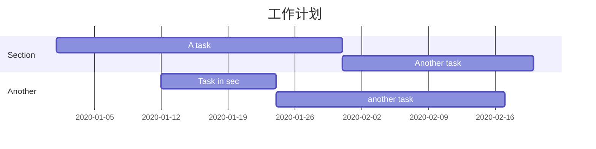
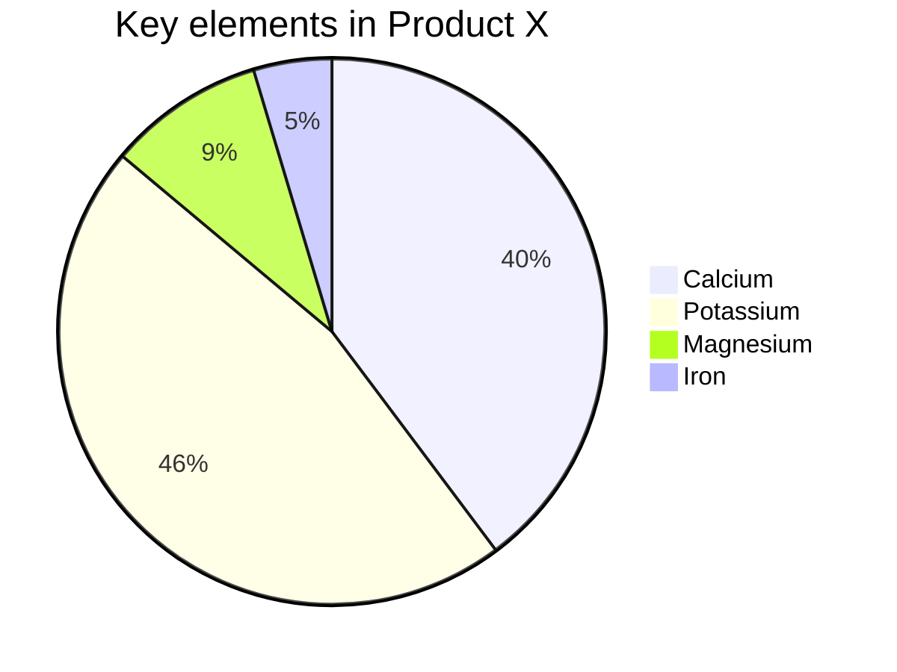
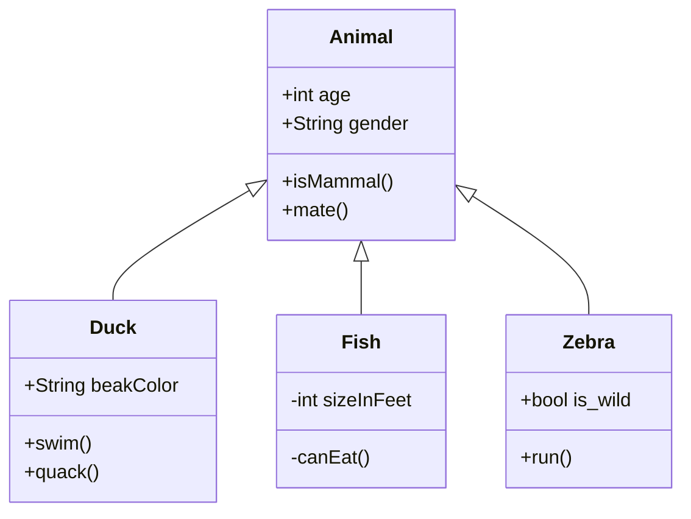

[TOC]

# 操作系统

## 操作命令

1. **[操作系统命令总结](docs/operating-system/操作系统命令.md)**

## 系统调用

## 内存管理

## CPU管理

## Shell

# 计算机网络

# 数据结构与算法

# 编程语言

## Java

### 基础

1. **[Java 基础知识](docs/language/java/basis/Java基础知识.md)**
2. **[Java 基础知识疑难点/易错点](docs/language/java/basis/Java基础知识疑难点.md)**

**重要知识点详解：**

1. [枚举](docs/language/java/basis/用好Java中的枚举真的没有那么简单.md) 
2. [Java 常见关键字总结：final、static、this、super!](docs/language/java/basis/Java常见关键字总结.md)
3. [什么是反射机制?反射机制的应用场景有哪些?](docs/language/java/basis/反射机制.md)
4. [代理模式详解：静态代理+JDK/CGLIB 动态代理实战](docs/language/java/basis/代理模式详解.md)
5. [BIO,NIO,AIO 总结 ](docs/language/java/basis/BIO,NIO,AIO总结.md)

### 容器 

### 并发

### JVM

## C++

## Go

## Python

## Scala

# 工具框架

## 队列

### Kafka

## 关系型数据库

### Mysql

### Oracle

## 缓存数据库

### Redis

## 数据一致性

### Zookeeper

## 分布式数据存储

### Hadoop

### Hive

### HBase

## OLAP

### Impala

### Clickhouse

### Kudu

### Oozie

### Elasticsearch

## 数据计算

### Spark

### Flink

## CDH/CDP

### 集成搭建

### API

### 第三方服务集成

